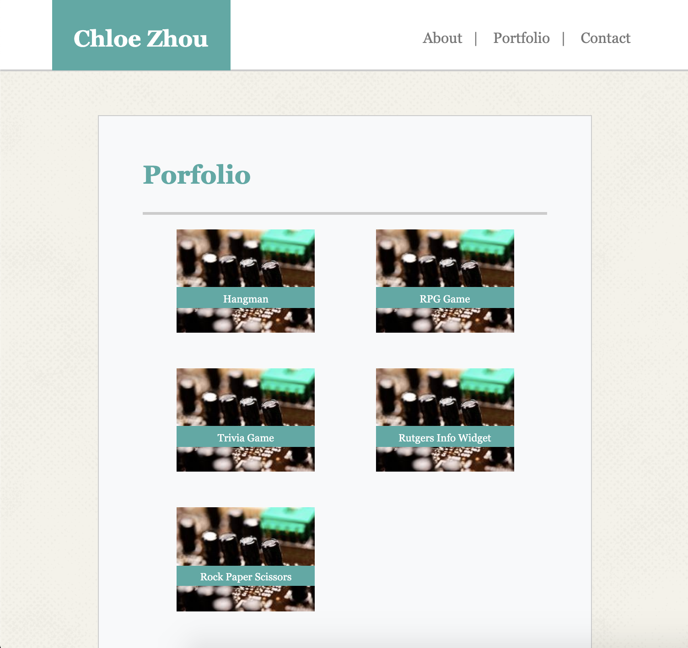
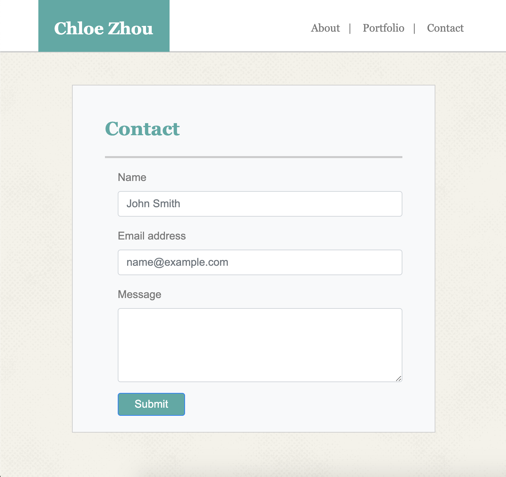
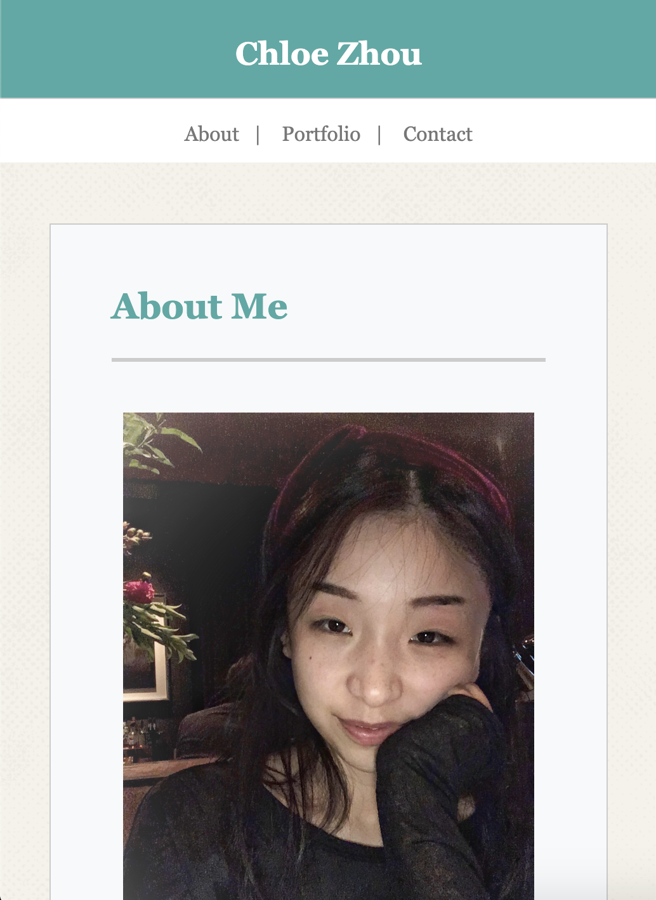
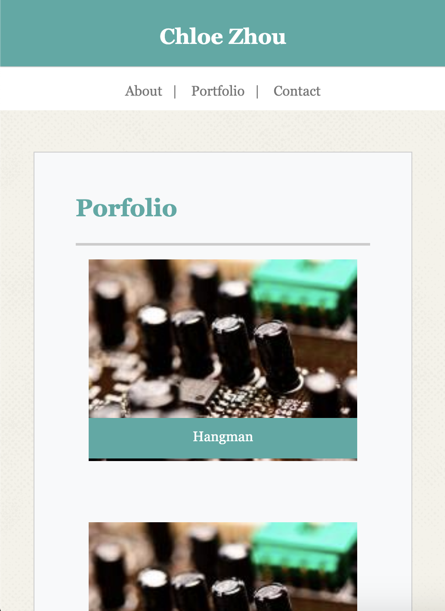
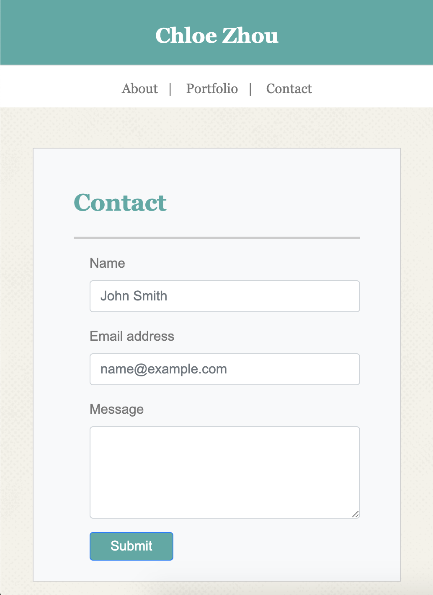

# Bootstrap-Portfolio

This project builds portfolio layout using the Bootstrap CSS Framework. 

 

#### Demo for extra large screen

***
 

#### Demo for small screen

***
 

#### Demo for extra small screen

***
 

#### Technology Used

* HTML
* CSS

#### Author
      Chloe Zhou